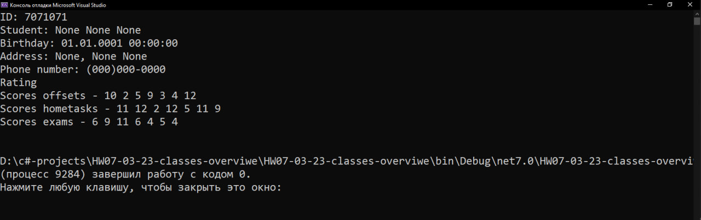

# Дз от 02/03/23. regular expressions
##  **Задание 1.** Реализовать класс Student, который содержит приватные поля для хранения фамилии, имени, отчества, даты рождения (есть стандартный тип Date), домашнего адреса (желательно оформить в виде отдельного кастомного типа), телефонного номера. Также за каждым студентом закреплены 3 массива (желательно даже не массива, а стандартного списка) оценок – зачёты, домашние задания, экзамены. Обязательные методы: 2-3 версии конструктора с параметрами и делегированием, публичные геттеры и сеттеры для всех полей, показ всех данных о студенте (желательно туСтрингом).
<br/>

### Cоздаём класс Address который будет полем Student соддержаший адрес
 ```cs
using System;

namespace HW07_03_23_classes_overviwe
{
    public class Address
    {
        private string city;
        private string street;
        private string homeNumber;

        public Address(string city, string street, string homeNumber)
        {
            setCity(city);
            setStreet(street);
            setHomeNumber(homeNumber);
        }

        public void setCity(string city) { this.city = city; }
        public void setStreet(string street) { this.street = street; }
        public void setHomeNumber(string homeNumber) { this.homeNumber = homeNumber; }

        public string getCity() { return this.city; }
        public string getStreet() { return this.street; }
        public string getHomeNumber() { return this.homeNumber; }

        public override string ToString()
        {
            return ($"{getCity()}, {getStreet()} {getHomeNumber()}");
        }
    }
}
```

### Создаем главный класс Student содердащий все поля и методы
```cs
using System;
using System.Net;
using System.Text.RegularExpressions;
using System.Xml.Linq;

namespace HW07_03_23_classes_overviwe
{
    public class Student
    {
        private int id;
        private string name;
        private string lastname;
        private string surname;
        private string phoneNumber;
        DateTime birthday;
        Address address;

        List<int> offsets = new List<int>();
        List<int> hometasks = new List<int>();
        List<int> exams = new List<int>();

        public Student(string name, string lastname, string surname, DateTime birthday, string phoneNumber, string city, string street, string homeNumber)
        {
            setName(name);
            setLastname(lastname);
            setSurname(surname);
            setPhoneNumber(phoneNumber);
            setBirthday(birthday);
            setAddress(city, street, homeNumber);
            fillingLists();
            id = new Random().Next(357943, 8357235);
        }
        public Student(string name, string lastname, string surname, DateTime birthday, string phoneNumber) :
            this(name, lastname, surname, birthday, phoneNumber, "None", "None", "None")
        { }
        public Student(string name, string lastname, string surname) :
            this(name, lastname, surname, new DateTime(1, 1, 1), "(000)000-0000", "None", "None", "None")
        { }
        public Student() :
            this("None", "None", "None", new DateTime(1, 1, 1), "(000)000-0000", "None", "None", "None")
        { }

        public void setName(string name) { this.name = name; }
        public void setLastname(string lastname) { this.lastname = lastname; }
        public void setSurname(string surname) { this.surname = surname; }
        public void setPhoneNumber(string phoneNumber)
        {
            string phoneRegexp = @"^\(\d{3}\)\d{3}\-\d{4}$";
            do
            {
                this.phoneNumber = phoneNumber;
            } while (!Regex.IsMatch(phoneNumber, phoneRegexp));
        }
        public void setBirthday(DateTime birthday) { this.birthday = birthday; }
        public void setAddress(string city, string street, string homeNumber) { this.address = new Address(city, street, homeNumber); }

        public int getId() { return this.id; }
        public string getName() { return this.name; }
        public string getLastname() { return this.lastname; }
        public string getSurname() { return this.surname; }
        public string getPhoneNumber() { return this.phoneNumber; }
        public DateTime getBirthday() { return this.birthday; }
        public Address getAddress() { return this.address; }

        public void fillingLists()
        {
            for (int i = 0; i < 7; ++i)
            {
                offsets.Add(new Random().Next(1, 13));
                hometasks.Add(new Random().Next(1, 13));
                exams.Add(new Random().Next(1, 13));
            }
        }

        public List<int> getListOffsets() { return offsets; }
        public List<int> getListHometasks() { return hometasks; }
        public List<int> getListExams() { return exams; }

        // Конвертация типа List<int> в String для дальнейшего взаимодействия в ToString()
        public string getListOffsetsForToString() { return string.Join(" ", this.getListOffsets()); }
        public string getListHometasksForToString() { return string.Join(" ", this.getListHometasks()); }
        public string getListExamsForToString() { return string.Join(" ", this.getListExams()); }

        public override string ToString()
        {
            return ($"ID: {getId()}\n" +
                $"Student: {getLastname()} {getName()} {getSurname()}\n" +
                $"Birthday: {getBirthday()}\n" +
                $"Address: {getAddress()}\n" +
                $"Phone number: {getPhoneNumber()}\n" +
                $"Rating\n" +
                $"Scores offsets - {getListOffsetsForToString()}\n" +
                $"Scores hometasks - {getListHometasksForToString()}\n" +
                $"Scores exams - {getListExamsForToString()}\n");
        }
    }
}
```

### Результат:

____
